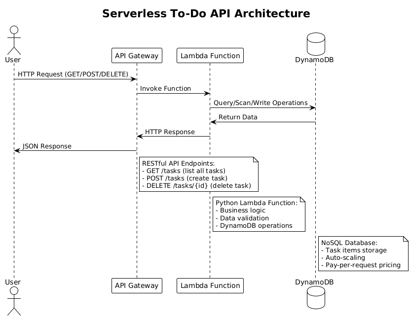

# Serverless Todo API

[](https://opensource.org/licenses/Apache-2.0)
[](https://www.terraform.io/)
[](https://www.python.org/)
[](https://aws.amazon.com/)
[](https://aws.amazon.com/serverless/)

A simple, serverless To-Do list API built with AWS services and Terraform. This project demonstrates how to build a complete serverless application using AWS Lambda, API Gateway, and DynamoDB.

## Table of Contents

- [Features](#features)
- [Quick Start](#quick-start)
- [Architecture](#architecture)
- [API Endpoints](#api-endpoints)
- [Setup Instructions](#setup-instructions)
- [Available Commands](#available-commands)
- [Additional Documentation](#additional-documentation)
- [Project Structure](#project-structure)
- [Cost Considerations](#cost-considerations)
- [Cleanup](#cleanup)
- [Learning Objectives](#learning-objectives)
- [Next Steps](#next-steps)
- [Troubleshooting](#troubleshooting)

## Architecture

The application follows a serverless architecture pattern:

- **API Gateway**: Provides HTTP endpoints for the REST API
- **Lambda Function**: Contains the business logic for task operations
- **DynamoDB**: Serverless NoSQL database for storing tasks
- **Terraform**: Infrastructure as Code for provisioning all resources



## Features

- Create new tasks with title and description
- List all tasks (sorted by creation date)
- Delete specific tasks by ID
- RESTful API design
- Serverless and scalable
- Pay-per-use pricing model

## Quick Start

[](https://github.com/bansikah22/aws-serverless-demo#setup-instructions)
[](https://github.com/bansikah22/aws-serverless-demo#api-endpoints)
[](https://github.com/bansikah22/aws-serverless-demo#additional-documentation)

**Deploy in 3 steps:**
```bash
# 1. Configure AWS credentials
aws configure

# 2. Deploy infrastructure
./scripts/deploy.sh

# 3. Test the API
curl https://your-api-gateway-url/dev/tasks
```

## API Endpoints

| Method | Endpoint | Description | Example |
|--------|----------|-------------|---------|
| GET | `/tasks` | List all tasks | `curl https://api-url/dev/tasks` |
| POST | `/tasks` | Create a new task | `curl -X POST https://api-url/dev/tasks -H "Content-Type: application/json" -d '{"title": "Task", "description": "Description"}'` |
| DELETE | `/tasks/{id}` | Delete a specific task | `curl -X DELETE https://api-url/dev/tasks/{task-id}` |

### Request/Response Examples

#### Create Task (POST /tasks)
```json
{
  "title": "Learn AWS Serverless",
  "description": "Build a serverless todo API"
}
```

#### List Tasks (GET /tasks)
```json
{
  "tasks": [
    {
      "id": "uuid-here",
      "title": "Learn AWS Serverless",
      "description": "Build a serverless todo API",
      "completed": false,
      "created_at": "2024-01-01T12:00:00",
      "updated_at": "2024-01-01T12:00:00"
    }
  ]
}
```

## Prerequisites

- AWS CLI configured with appropriate credentials
- Terraform (version >= 1.0)
- Python 3.11+
- S3 bucket for Terraform state (optional but recommended)

## Setup Instructions

### 1. Configure AWS Credentials

```bash
aws configure
```

Or export environment variables:
```bash
export AWS_ACCESS_KEY_ID="your-access-key"
export AWS_SECRET_ACCESS_KEY="your-secret-key"
export AWS_SESSION_TOKEN="your-session-token"  # If using temporary credentials
```

### 2. Update Terraform Backend (Optional)

Edit `terraform/main.tf` and update the S3 backend configuration:

```hcl
backend "s3" {
  bucket = "your-terraform-state-bucket"
  key    = "serverless-todo-api/terraform.tfstate"
  region = "us-east-1"
}
```

### 3. Deploy Infrastructure

**Option A: Using the deployment script (Recommended)**
```bash
./scripts/deploy.sh
```

**Option B: Manual deployment**
```bash
cd terraform
terraform init
terraform plan
terraform apply
```

### 4. Test the API

After deployment, Terraform will output the API Gateway URL. Use the test script:

```bash
python scripts/test_api.py https://your-api-gateway-url/dev
```

Or test manually with curl:

```bash
# Create a task
curl -X POST https://your-api-gateway-url/dev/tasks \
  -H "Content-Type: application/json" \
  -d '{"title": "Test Task", "description": "This is a test"}'

# List tasks
curl https://your-api-gateway-url/dev/tasks

# Delete a task (replace {id} with actual task ID)
curl -X DELETE https://your-api-gateway-url/dev/tasks/{id}
```

### 5. Manual Lambda Package Creation (Alternative)

If you prefer to create the Lambda deployment package manually instead of using the automated script:

```bash
# Create the Lambda package manually
./scripts/create_lambda_package.sh

# Then deploy
cd terraform
terraform init
terraform plan
terraform apply
```

The `create_lambda_package.sh` script:
- Zips the Lambda function code and dependencies
- Calculates the SHA256 hash for Terraform
- Places the package in the `terraform/` directory
- Excludes unnecessary files (`.pyc`, `__pycache__`, etc.)

## Project Structure

```
aws-serverless-demo/
├── terraform/                 # Terraform infrastructure code
│   ├── main.tf               # Main configuration
│   ├── variables.tf          # Variable definitions
│   ├── dynamodb.tf           # DynamoDB table
│   ├── lambda.tf             # Lambda function
│   ├── api_gateway.tf        # API Gateway
│   └── outputs.tf            # Output values
├── src/
│   └── lambda/               # Lambda function source code
│       ├── lambda_function.py
│       └── requirements.txt
├── scripts/
│   ├── deploy.sh             # Automated deployment script
│   ├── cleanup.sh            # Infrastructure cleanup script
│   ├── test_api.py           # API testing script
│   └── create_lambda_package.sh # Lambda package creation
├── docs/
│   ├── architecture.puml     # Architecture diagram (PlantUML)
│   ├── images/
│   │   └── serverless-todo.png # Architecture visualization
│   ├── architecture-explanation.md # Comprehensive architecture guide
│   ├── makefile-guide.md     # Complete Makefile usage guide
│   ├── api-testing-guide.md  # Comprehensive API testing guide
│   ├── api-quick-reference.md # Quick API reference
│   └── lambda-package-creation.md # Lambda package documentation
├── Makefile                  # Common commands
└── README.md
```

## Cost Considerations

This serverless architecture is designed to be cost-effective:

- **Lambda**: Pay only for compute time (100ms increments)
- **API Gateway**: Pay per API call
- **DynamoDB**: Pay-per-request pricing model
- **No idle costs**: Resources scale to zero when not in use

## Cleanup

To avoid ongoing charges, destroy the infrastructure:

**Option A: Using the cleanup script (Recommended)**
```bash
./scripts/cleanup.sh
```

**Option B: Manual cleanup**
```bash
cd terraform
terraform destroy
```

**Option C: Using Makefile**
```bash
make destroy
```

## Learning Objectives

This project covers:

1. **Serverless Architecture**: Understanding Lambda, API Gateway, and DynamoDB
2. **Infrastructure as Code**: Using Terraform for resource provisioning
3. **API Design**: RESTful API patterns and best practices
4. **AWS IAM**: Role-based permissions and security
5. **Event-Driven Programming**: Lambda function event handling
6. **NoSQL Database**: DynamoDB operations and data modeling
7. **DevOps Practices**: Automated deployment and testing
8. **Professional Code Organization**: Modular structure and best practices

## Available Commands

The project includes a Makefile with common commands:

```bash
make help          # Show all available commands
make init          # Initialize Terraform
make plan          # Plan Terraform deployment
make deploy        # Deploy the infrastructure
make destroy       # Destroy the infrastructure
make test          # Test the API (requires API_URL parameter)
make package       # Create Lambda deployment package
make format        # Format Python code
make lint          # Lint Python code
make clean         # Clean up temporary files
```

**Quick Start:**
```bash
# Show all available commands
make help

# Deploy the infrastructure
make deploy

# Test the API (replace with your actual API URL)
make test API_URL=https://your-api-gateway-url/dev

# Clean up when done
make destroy
```

**For detailed Makefile usage, see [Makefile Guide](docs/makefile-guide.md)**

## Additional Documentation

For detailed information, see the documentation in the `docs/` directory:

- **[Architecture Explanation](docs/architecture-explanation.md)** - Comprehensive guide explaining serverless concepts and AWS services
- **[Makefile Guide](docs/makefile-guide.md)** - Complete guide for using the Makefile commands
- **[API Testing Guide](docs/api-testing-guide.md)** - Comprehensive guide with curl commands
- **[API Quick Reference](docs/api-quick-reference.md)** - Quick reference for API endpoints
- **[Lambda Package Creation](docs/lambda-package-creation.md)** - Detailed documentation for the package creation script

## Next Steps

Consider extending this project with:

- User authentication and authorization
- Task completion status updates
- Task categories and tags
- Search and filtering capabilities
- CloudWatch monitoring and logging
- CI/CD pipeline with GitHub Actions
- Frontend web application

## Troubleshooting

### Common Issues

1. **Lambda timeout**: Increase timeout in `variables.tf`
2. **Permission errors**: Check IAM roles and policies
3. **API Gateway CORS**: CORS headers are already configured
4. **DynamoDB errors**: Verify table name and permissions

### Logs

Check CloudWatch logs for Lambda function debugging:

```bash
aws logs describe-log-groups --log-group-name-prefix "/aws/lambda/serverless-todo-api"
```

## Contributing

[](CONTRIBUTING.md)
[](https://github.com/bansikah22/aws-serverless-demo/issues)
[](https://github.com/bansikah22/aws-serverless-demo/pulls)

Contributions are welcome! Please feel free to submit a Pull Request.

## Support

[](https://github.com/bansikah22/aws-serverless-demo/discussions)
[](https://github.com/bansikah22/aws-serverless-demo/issues)

If you encounter any issues or have questions:
1. Check the [Troubleshooting](#troubleshooting) section
2. Review the [Additional Documentation](#additional-documentation)
3. Open a [GitHub Issue](https://github.com/bansikah22/aws-serverless-demo/issues)
4. Start a [Discussion](https://github.com/bansikah22/aws-serverless-demo/discussions)

## License

This project is licensed under the Apache License 2.0 - see the LICENSE file for details.

---

<div align="center">

**Built with ❤️ using AWS Serverless Technologies**

[](https://aws.amazon.com/)
[](https://www.terraform.io/)
[](https://www.python.org/)

</div>
